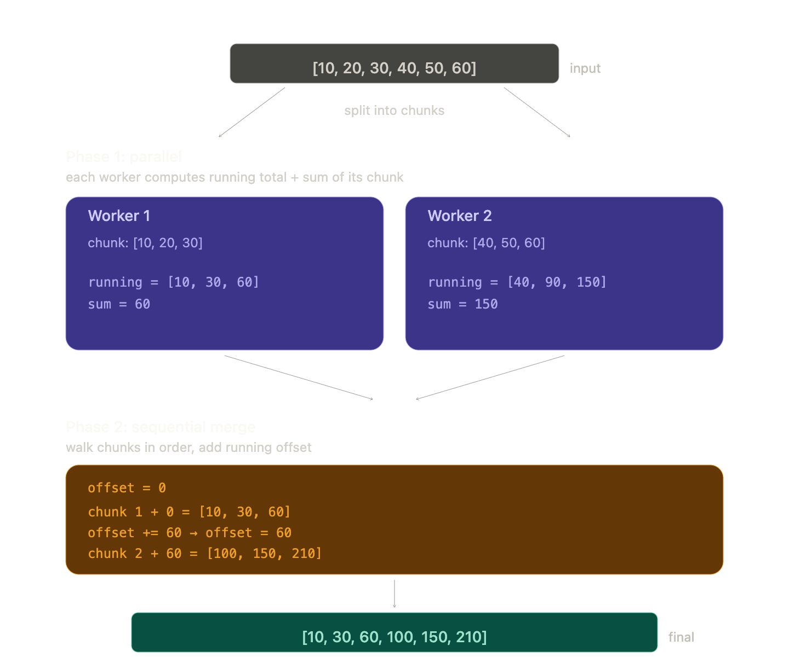

# Week 1 — Lab 2 Notes: The Complexity of Parallelizing Tasks

Concepts and a code walkthrough for `lab/ism6562-week01-lab2.ipynb`.

> **Prerequisite:** read `week1_gil_and_multiprocessing.md` first. This lab assumes you understand cores, processes, the GIL, and `multiprocess.Pool`.

---

## 1. The Big Idea of Lab 2

Lab 1 showed an **embarrassingly parallel** problem — 10,000 independent tasks that can be done in any order, by any worker, with no coordination. That's the easy case.

Lab 2 shows the opposite: a problem where every step **depends on the previous step's result**. Splitting it across workers isn't just slower — done naively, it produces the *wrong answer*. And even when you fix it, parallelism doesn't help.

This lab is the "uncomfortable middle" of distributed computing: not every problem can be parallelized, and recognizing which is which is a real skill.

---

## 2. The Problem: Running Total

A **running total** (or cumulative sum) produces a new list where each element is the sum of all elements up to that point.

```text
Input:         [5,  3,  8,  2,  7]
Running total: [5,  8, 16, 18, 25]
```

This shows up everywhere in business:

- **Bank balance** — each transaction depends on the previous balance.
- **Year-to-date revenue** — each month's YTD includes all prior months.
- **Inventory levels** — current stock depends on all previous shipments and sales.

The lab generates 20,000,000 fake transactions to work with:

```python
random.seed(42)
num_transactions = 20_000_000
transactions = [random.randint(-100, 200) for _ in range(num_transactions)]
```

---

## 3. The Sequential Baseline

```python
def sequential_running_total(data):
    result = []
    running_sum = 0
    for value in data:
        running_sum += value
        result.append(running_sum)
    return result
```

A simple loop. Walk through the list, keep a running sum, append after every step.

On the lab's 20M-element input it takes about **0.6 seconds**. Cheap per-element work; lots of elements.

This is the number to beat.

---

## 4. The Naive Parallel Attempt — and Why It's Wrong

The "obvious" parallelization: split the list into chunks, have each worker compute a running total for its chunk, stitch results back together.

```python
def chunk_running_total(chunk):
    result = []
    running_sum = 0
    for value in chunk:
        running_sum += value
        result.append(running_sum)
    return result

chunks = split_into_chunks(transactions, number_of_cores_to_use)

with Pool(number_of_cores_to_use) as pool:
    chunk_results = pool.map(chunk_running_total, chunks)

naive_result = []
for chunk_result in chunk_results:
    naive_result.extend(chunk_result)
```

Looks reasonable. Output:

```text
Correct final balance:  999,687,766
Naive parallel balance: 66,658,484
Match: False
```

The numbers **don't match** — by a factor of ~15×. To see why, run on a tiny input:

```text
Correct running total of [5, 3, 8, 2, 7, 1, 4, 6]:
   [5, 8, 16, 18, 25, 26, 30, 36]

Worker A on first half  [5, 3, 8, 2]   →  [5, 8, 16, 18]
Worker B on second half [7, 1, 4, 6]   →  [7, 8, 12, 18]   ← WRONG

Stitched:  [5, 8, 16, 18, 7, 8, 12, 18]
                          ▲
                          Worker B started from 0,
                          but it should have started from 18.
```

### Why this happens — data dependencies

Every element of the running total depends on **all previous elements**. Worker B can't start until it knows Worker A's final value. But that defeats the entire point of parallelism — you wanted them to run *at the same time*, not in sequence.

This is called a **data dependency**, and it's the single biggest enemy of parallel computing.

```text
Embarrassingly parallel (Lab 1):
   task(0), task(1), task(2), …  are independent
   ──► any worker can do any task in any order

Data-dependent (Lab 2):
   result[i] = result[i-1] + data[i]
   ──► result[5] needs result[4], which needs result[3], …
   ──► no worker can start element i without finishing element i-1
```

---

## 5. The Two-Phase Fix

You *can* parallelize a running total, but it takes a more clever algorithm.



The whole trick in one picture: workers compute *local* running totals in parallel (knowing only their own chunk), then a quick sequential pass walks the chunk results in order and shifts each one up by the **offset** — the sum of every preceding chunk — to recover the global running total.

**Phase 1 — parallel:** each worker computes its chunk's running total *as if it started from 0*, AND returns the chunk's final sum.

```python
def chunk_running_total_with_sum(chunk):
    result = []
    running_sum = 0
    for value in chunk:
        running_sum += value
        result.append(running_sum)
    return (result, running_sum)
```

**Phase 2 — sequential:** walk through the chunk results in order, keeping an `offset` (the total of all previous chunks), and add it to every element of the current chunk.

```python
corrected_result = []
offset = 0
for chunk_totals, chunk_sum in phase1_results:
    for value in chunk_totals:
        corrected_result.append(value + offset)
    offset += chunk_sum
```

### Why this works — picture

```text
Workers run independently in Phase 1 (each starting from 0):

  Chunk 1: [5, 3, 8, 2]      ──► [5, 8, 16, 18]    sum = 18
  Chunk 2: [7, 1, 4, 6]      ──► [7, 8, 12, 18]    sum = 18

Phase 2 stitches them with the offsets:

  Chunk 1 offset = 0
     [5+0, 8+0, 16+0, 18+0]  =  [5, 8, 16, 18]

  Chunk 2 offset = 18 (sum of all previous chunks)
     [7+18, 8+18, 12+18, 18+18]  =  [25, 26, 30, 36]

  Final: [5, 8, 16, 18, 25, 26, 30, 36]   ✓ matches sequential
```

The trick: Phase 1 produces wrong absolute values but **correct relative values within each chunk**. Phase 2 fixes the absolute values by sliding each chunk up by the right offset.

---

## 6. Performance — Why the Fix Is Often Slower

```text
Sequential                : ~0.6  s
Two-phase parallel (15 cores) : ~14  s
```

Yes, *slower*. About 20× slower. Three reasons:

| Cost | What's happening |
| --- | --- |
| **Pickling 20M integers** | The 20-million-element list has to be sliced into chunks and pickled to send to each worker. Then each worker's result list has to be pickled back. That's hundreds of MB serialized through OS pipes. |
| **Phase 2 is sequential** | The offset-application loop walks every one of 20M elements and **cannot be parallelized** — each chunk's offset depends on all previous chunks' sums. |
| **Double the work** | Phase 1 does one pass over the data; Phase 2 does another. The sequential version does only one pass. |

The per-element computation (`+= value`) is *too cheap* for parallelism to pay off. The IPC overhead per element dwarfs the work per element.

### When does the fix actually help?

The two-phase approach pays off when the per-element work is **expensive enough** that the IPC overhead is small in comparison. Think:

- Each "element" is a 1 GB log file you have to parse.
- Each "element" is a Monte Carlo simulation that takes 100 ms.
- Each "element" is a model inference that takes 50 ms.

For cheap arithmetic on lots of items? The simple `for` loop wins. Always.

---

## 7. Generalizing — Where Does Parallelism Help?

Lab 1 and Lab 2 are two ends of a spectrum.

```text
   Embarrassingly parallel  ◄──────────────►  Inherently sequential
   (Lab 1)                                    (Lab 2's running total)

   train one model per chunk                  cumulative sum
   resize one image per file                  parsing one big string
   roll dice per simulation                   recursive recurrence
   apply f(x) to each row                     state-machine update
```

Most real Big Data problems sit somewhere in between, and the framework you choose has to match. Spark, Dask, and similar tools are full of carefully designed *parallel reductions* — `reduce`, `aggregate`, `scan` (running total!) — that work hard to extract parallelism from operations that look sequential.

### Things to ask before parallelizing

1. **Is each task truly independent?** If task `i` needs the output of task `i-1`, you have a Lab-2 problem.
2. **Is per-task work expensive enough to amortize IPC?** Cheap loops over many items are usually faster sequential.
3. **How much data has to cross process boundaries?** Pickling 20M ints is hundreds of MB of overhead.
4. **Can the "stitch" step be parallelized too?** If not, you're paying Amdahl's Law: any sequential portion caps your max speedup.

---

## 8. Connection to Distributed Big Data

The same lessons scale up to Spark / Dask / distributed clusters — only worse:

| Scope | Communication channel | Cost of moving data |
| --- | --- | --- |
| Single machine, multiprocessing | OS pipes (IPC) | Microseconds, MB/s throughput |
| Cluster, distributed framework | Network (TCP, RPC, shuffles) | Milliseconds, much lower throughput |

A naive parallel running total on a Spark cluster would be even slower than the multiprocessing version, because the chunks have to travel across the network instead of an OS pipe. Distributed frameworks handle "scan" operations (cumulative sums and similar) with specialized algorithms that minimize the sequential phase.

---

## Lab 2 Takeaways

1. **Data dependencies block parallelism.** When element *i* depends on element *i-1*, workers can't run independently.
2. **Naive splitting can produce wrong answers** — not just slow ones. Always validate against a sequential reference.
3. **Fixing it adds complexity and serial work.** Two-phase approaches do roughly twice the work, and the second phase often can't be parallelized.
4. **More workers ≠ faster.** When the per-task work is cheap or the data is large, IPC overhead dominates. Sometimes the sequential `for` loop is the right answer.
5. **Recognize the pattern early.** Some problems are embarrassingly parallel (Lab 1), some are inherently sequential (Lab 2), and most real workloads are somewhere in between. Knowing which is which is the skill.
