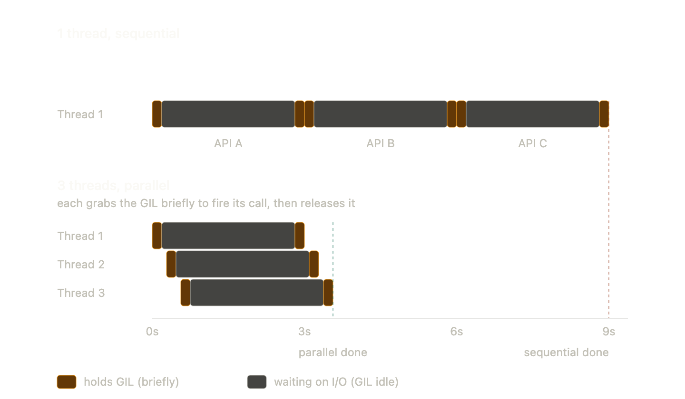

# Week 1 — Lab 1 Notes: Python Concurrency and Parallel Processing

Concepts and a code walkthrough for `lab/ism6562-week01-lab.ipynb`.

---

## Part A — Foundational Concepts

### 1. CPU (Central Processing Unit)

The **CPU** is the chip in your computer that actually executes instructions — arithmetic, comparisons, memory loads/stores, branches. Every program ultimately becomes a stream of instructions handed to the CPU.

Key idea: a CPU executes **one stream of instructions at a time per core**. If you want to do two things truly simultaneously, you need either two CPUs or one CPU with multiple cores.

### 2. Cores

A **core** is an independent execution unit *insise* a CPU. A modern CPU package usually contains many cores on the same chip.

- **1 core** → can execute one instruction stream at a time.
- **N cores** → can execute N instruction streams *truly* in parallel.

In the lab, this line reports your core count:

```python
import multiprocess
multiprocess.cpu_count()   # e.g. 12 or 16
```

The lab leaves one core for the OS (`number_of_cores - 1`) so the system stays responsive while the rest do the heavy work.

#### Logical vs. physical cores

- **Physical core** — actual silicon execution unit.
- **Logical core** — what the OS sees; with hyper-threading/SMT, each physical core appears as 2 logical cores. They share execution resources, so 2 logical cores ≠ 2× the throughput of 1 physical core.

`cpu_count()` typically returns logical cores.

### 3. Process vs. Thread

You need these to make sense of the GIL.

- **Process** — an instance of a running program with its **own memory space**. Two processes cannot accidentally read or corrupt each other's variables. Communication between them requires explicit IPC (inter-process communication) — serialization through pipes, queues, sockets, or shared memory.
- **Thread** — a separate execution path *inside* the same process, sharing memory with all other threads in that process. Cheap to create, fast to communicate (just shared variables), but easy to corrupt without careful synchronization.

| Aspect | Threads | Processes |
| --- | --- | --- |
| Memory | Shared | Isolated |
| Creation cost | Low | Higher |
| Communication | Direct (shared vars) | IPC (serialize/copy) |
| Crash impact | Takes down whole process | Isolated to that process |

Lab 1 uses `multiprocess.Pool` — that's **processes**, not threads. The reason why is the GIL.

### 4. CPython

**CPython** is the standard, reference implementation of the Python language — written in C. When you type `python` on the command line, you are almost certainly running CPython.

It is *one of several* implementations:

- **CPython** — the default; what `python.org` ships.
- **PyPy** — alternative implementation with a JIT compiler; faster for many workloads.
- **Jython** — runs on the JVM.
- **IronPython** — runs on .NET.

This distinction matters because **the GIL is a property of CPython, not of the Python language itself**. Other implementations may not have one (e.g., Jython does not).

### 5. Mutex (Mutual Exclusion Lock)

A **mutex** is a synchronization primitive that allows **only one thread at a time** to hold it. The pattern:

1. A thread *acquires* the mutex before entering a critical section.
2. While it holds the mutex, no other thread can acquire it — they must wait.
3. The thread *releases* the mutex when done; one waiting thread is then allowed in.

The name is short for **mut**ual **ex**clusion — only one participant in the critical section at a time.

Mutexes exist to prevent **race conditions**: situations where two threads read/modify shared data at the same time and corrupt it. Classic example — two threads both running `counter += 1` can interleave such that the final value is wrong.

The GIL is, mechanically, a mutex.

### 6. The GIL (Global Interpreter Lock)

The **Global Interpreter Lock** is a mutex inside CPython that allows **only one thread to execute Python bytecode at a time**, *per process*.

- "Global" — there is one GIL covering the entire interpreter, not one per object or data structure.
- "Interpreter" — it guards the interpreter's internal state (notably the reference-count-based memory manager).
- "Lock" — it is a mutex; threads acquire and release it as they run.

#### Why CPython has a GIL

- CPython uses **reference counting** for memory management. Every object tracks how many references point to it; when the count hits zero, the object is freed. Without a lock, two threads incrementing/decrementing the same refcount concurrently would race and either leak memory or free objects still in use.
- A single global lock is the simplest correct solution. It also keeps C extensions (NumPy, etc.) easier to write, since they can assume single-threaded execution of Python code.

#### What the GIL means in practice

- **CPU-bound Python code does not get faster with more threads.** Even on a 16-core machine, only one thread runs Python bytecode at a time. Adding threads adds overhead without adding parallelism.
- **I/O-bound code *can* benefit from threads.** When a thread blocks on the network, disk, or a system call, it releases the GIL so other threads can run. So `requests.get(...)` across many URLs in threads still parallelizes the *waiting*.
- **C extensions can release the GIL.** NumPy, Pandas operations, and other native code often release the GIL during heavy computation, which is one reason they appear to scale even though they're called from Python.

#### How `multiprocessing` sidesteps the GIL

Each **process** has its own Python interpreter and therefore its own GIL. Run N processes → N GILs → N cores can run Python bytecode at once. This is exactly what `Pool(N)` does in Lab 1, and it's why the parallel run is ~8× faster than serial despite the GIL.

The trade-off: processes don't share memory, so data has to be serialized (pickled) and copied between them.

### 7. How These Concepts Connect

```text
CPU (chip)
 └── Cores (independent execution units)
       └── Processes (one Python interpreter each, one GIL each)
             └── Threads (share memory; share the one GIL of their process)
```

- More **cores** → more potential parallelism in hardware.
- The **GIL** is a **mutex** living inside each **CPython** process; it serializes Python bytecode execution among threads of that process.
- **Multiprocessing** dodges the GIL by spawning more processes — each with its own interpreter and lock — so cores can actually be used in parallel.
- **Distributed frameworks** (Spark, Dask, Ray) extend the same idea across machines: more workers, each with its own memory and interpreter, coordinated by a driver.

---

## Part B — Deep Dive: Plain-English Definitions

### B.1 What is an interpreter?

An **interpreter** is a program that reads your source code and runs it — *line by line, instruction by instruction* — instead of compiling it to a standalone executable up front.

Compare:

- **Compiled language (C, Rust, Go):** source → machine code (`.exe` / binary) → run directly on the CPU.
- **Interpreted language (Python, JavaScript, Ruby):** source → another program (the interpreter) reads it and executes it on your behalf.

So when you run `python my_script.py`, you are launching the Python interpreter, handing it your file, and asking it to execute the instructions inside.

### B.2 What is CPython?

**CPython** is the actual program that *is* the Python interpreter on your computer.

- The **Python language** is a specification — rules about syntax, types, behavior.
- **CPython** is the most popular *implementation* of that specification, written in the **C** programming language. (Hence the name: **C** + **Python**.)
- When you install Python from python.org, install it via Homebrew, or run `python3` in your terminal, you are running CPython.

Other implementations exist (PyPy, Jython, IronPython, GraalPy), but >99% of Python users are running CPython. So in this course, "the Python interpreter" and "CPython" mean the same thing.

### B.3 What is bytecode?

CPython doesn't directly execute the `.py` text file. There's an intermediate step:

1. CPython reads your `.py` file.
2. It **compiles** it into a lower-level, simplified format called **bytecode** — a sequence of small numeric instructions like `LOAD_FAST`, `BINARY_ADD`, `RETURN_VALUE`.
3. CPython's *virtual machine* then executes those bytecode instructions one by one.

Bytecode is **not** machine code. The CPU cannot run it directly. It's an intermediate language that the CPython virtual machine understands. Think of it as "Python's assembly language."

#### The translation pipeline, step by step

When you run `python my_script.py`, CPython doesn't go straight from text to running it. The source moves through several stages:

```text
my_script.py  ──►  tokens  ──►  AST  ──►  bytecode  ──►  VM executes
   (text)        (lexer)     (parser)    (compiler)     (eval loop)
```

1. **Lexing (tokenizing).** Reads the raw text and chops it into atomic tokens — keywords (`def`, `return`), identifiers (`add`, `a`, `b`), numbers, operators, indentation markers. Whitespace becomes meaningful here, since Python is indent-sensitive.
2. **Parsing.** Tokens are assembled into an **AST** (Abstract Syntax Tree) — a tree-shaped data structure that represents the *meaning* of the program. For example: "this is a function definition named `add` with two parameters, whose body is a single return-statement of a binary-add expression."
3. **Compiling.** The compiler walks the AST and emits **bytecode** — a flat sequence of small instructions for CPython's stack-based virtual machine. Each instruction is one byte of opcode (e.g., `LOAD_FAST = 124`) plus optional argument bytes.
4. **Executing.** CPython's VM is a giant loop (the "eval loop") that fetches the next bytecode instruction, decodes it, and executes it — pushing and popping values on an operand stack.

#### Seeing the bytecode

You can see this for yourself with the standard library `dis` module:

```python
import dis
def add(a, b):
    return a + b
dis.dis(add)
```

Output (Python 3.12):

```text
  2     RESUME              0
  3     LOAD_FAST           a        ← push value of `a` onto the stack
        LOAD_FAST           b        ← push value of `b` onto the stack
        BINARY_OP           + (add)  ← pop both, add, push result
        RETURN_VALUE                 ← pop top of stack and return it
```

This is why Python is described as **stack-based**: the VM doesn't have CPU-style registers; it just pushes and pops values on a Python-level operand stack. `LOAD_FAST` pushes a value; `BINARY_OP` consumes two values and produces one; `RETURN_VALUE` consumes one and exits the frame.

The GIL guards execution of **this byte stream** — that's what "only one thread executes Python bytecode at a time" actually means. Two threads can have their own ASTs and their own source — but only one of them advances through the CPython VM's bytecode at any instant.

### B.4 What is `__pycache__`?

Compiling `.py` → bytecode takes a small amount of time. To avoid redoing it every time you run the same file, CPython **caches** the bytecode on disk in a folder called `__pycache__`.

#### Where it lives

Right next to your code:

```text
my_project/
├── main.py
├── helper.py
└── __pycache__/
    ├── helper.cpython-312.pyc        ← cached bytecode for helper.py
    └── helper.cpython-311.pyc        ← if you also have 3.11 installed
```

#### How the filename is built

A cached file looks like `helper.cpython-312.pyc`. Three parts:

| Part | What it means |
| --- | --- |
| `helper` | The original module name (matches `helper.py`). |
| `cpython-312` | Implementation + version tag — this `.pyc` belongs to **CPython 3.12**. PyPy would write `helper.pypy39.pyc`. |
| `.pyc` | Compiled-Python file extension. |

Different Python versions emit slightly different bytecode, so they cache *separately* — that's why you can have multiple `.pyc` files for one source file.

#### What's actually inside a `.pyc`

A `.pyc` file is not just raw bytecode. It begins with a small **header**:

```text
┌──────────────────────────────────────────┐
│ Magic number  (4 bytes — version tag)    │
│ Bit field     (4 bytes — hash/timestamp) │
│ Source mtime  (4 bytes — timestamp)      │
│ Source size   (4 bytes)                  │
├──────────────────────────────────────────┤
│ Marshalled bytecode for the module       │
│ (LOAD_FAST, BINARY_OP, RETURN_VALUE, …)  │
└──────────────────────────────────────────┘
```

The **magic number** is a per-version signature — Python 3.12's magic number is different from 3.11's, so a 3.11 interpreter will never accidentally execute 3.12 bytecode.

#### How CPython decides whether to use the cache

When you `import helper`, CPython:

1. Looks for `__pycache__/helper.cpython-312.pyc` next to `helper.py`.
2. Reads the header. If the magic number doesn't match the running interpreter → recompile.
3. Compares the `helper.py` last-modified time against the timestamp recorded in the header. If the source has been edited → recompile.
4. If everything matches → skip compilation and load the cached bytecode directly.

That's why editing `helper.py` and re-running "just works" — CPython notices the source is newer and rebuilds the cache automatically.

#### When does caching actually happen

- **Imported modules are cached.** Run `python main.py`, and any `import helper` produces `__pycache__/helper.cpython-312.pyc`.
- **The top-level script is *not* cached.** `main.py` itself is recompiled every run. Only modules you `import` get a `.pyc`.
- **You can disable caching** with `python -B my_script.py`, or by setting the environment variable `PYTHONDONTWRITEBYTECODE=1`. Compilation still happens in memory; it just isn't written to disk.

#### Is it safe to delete?

Yes. `rm -rf __pycache__` will not break anything — Python regenerates the folder on the next import. Most projects also `.gitignore` `__pycache__/` since the contents are derived from the source.

#### Why bother caching?

Purely for **startup speed**. Once bytecode is in memory, runtime is identical whether it came from parsing `.py` or loading `.pyc`. For a 50-line script you'd never notice. For a large application like Django or pandas — which import hundreds of modules — caching turns a multi-second cold start into a sub-second warm start.

End-to-end execution flow:

```text
   my_script.py  (source text)
        │
        │  1. Parse & compile
        ▼
   bytecode  (LOAD_FAST, BINARY_ADD, …)
        │
        │  2. (Optional) cached to __pycache__/*.pyc
        │
        │  3. Executed by CPython's virtual machine
        ▼
   CPython VM ── (ultimately calls C code, which the CPU runs)
        │
        ▼
   CPU executes machine instructions
```

### B.5 What is a Python process?

A **Python process** is one running instance of the Python interpreter — i.e., one running CPython program — together with all the memory it has allocated.

- When you run `python script.py`, the operating system creates **one process** for you. That process holds the CPython interpreter, your loaded modules, your variables, your data, and exactly **one GIL**.
- When you call `Pool(8)`, the parent process spawns **8 child processes**. Each child is a *fresh* CPython interpreter with its *own* memory, its *own* GIL, and its *own* bytecode being executed.
- Processes are isolated by the OS. Process A literally cannot read Process B's variables; the memory addresses don't even mean the same thing.

That isolation is why `multiprocessing` can use multiple cores — eight independent GILs means eight bytecode streams running at the same time, one per core.

### B.6 What is a race condition?

A **race condition** is a bug that happens when two threads access shared data at the same time and the final result depends on the unpredictable order in which the OS happens to schedule them.

Concrete example — two threads both running `counter += 1`:

```text
counter += 1  is actually three steps:
   (a) read   counter         from memory  → register
   (b) add 1  to the register
   (c) write  register        back to counter
```

If Thread 1 and Thread 2 run on two cores and interleave like this:

```text
Time  Thread 1                Thread 2              counter (in memory)
----  ----------------------  --------------------  -------------------
 t0                                                       0
 t1   read counter (=0)                                   0
 t2                           read counter (=0)           0
 t3   add 1 → register=1                                  0
 t4                           add 1 → register=1          0
 t5   write 1                                             1
 t6                           write 1                     1   ← BUG
```

Both threads incremented; the counter should be 2; it is 1. One increment was *lost* because the operations interleaved.

Race conditions are nasty because they are **non-deterministic** — the program might work correctly 99 times in a row and fail the 100th, depending entirely on OS scheduling.

### B.7 "Thread safety for memory management" in Python

CPython manages memory using **reference counting**. Every Python object carries a small integer — the **refcount** — that tracks how many variables point to it. When the refcount hits 0, the object is destroyed and its memory freed.

- `x = [1, 2, 3]` → list's refcount becomes 1
- `y = x` → refcount becomes 2
- `del x` → refcount becomes 1
- `del y` → refcount becomes 0 → list is freed

Now imagine two threads, on two cores, both running `del y` on the same shared object at the same instant. Without synchronization, the refcount decrement is *exactly* the racy `counter += 1` from B.6. Possible outcomes:

- Both threads see refcount=1, both decrement, both write 0, both think they should free the object → **double-free**, program crashes.
- Refcount drops to 0 prematurely → object freed while still in use → **use-after-free**, program crashes or silently corrupts data.
- Refcount fails to drop to 0 when it should → **memory leak**.

This is what people mean by **"the GIL ensures thread safety for Python's memory management"**: the GIL forces refcount changes (and other interpreter-internal state) to happen one at a time, so two threads can never race on the same refcount. Correctness is guaranteed; the cost is that only one thread runs Python code at a time.

CPython could replace the GIL with finer-grained per-object locks (an ongoing effort called "free-threaded Python" / PEP 703), but doing it correctly is hard and historically slowed down single-threaded code. The single global lock has stuck around because it's simple and fast for the common case.

### B.8 Why spin up multiple threads for a Python process?

If the GIL only lets one thread run Python bytecode at a time, **why bother with threads at all?**

Because the GIL only blocks **CPU work** — it does **not** block **waiting**. Whenever a thread is parked on a network request, a disk read, or any other system call, the Python interpreter releases the GIL so a different thread can pick it up. That one rule is the entire reason `threading` is still useful in CPython for I/O-bound workloads.



The diagram contrasts two ways of calling three ~3-second APIs from a single Python process:

**Top — 1 thread, sequential**

- Thread 1 hits API A: grabs the GIL just long enough to fire the request (orange sliver), then releases it for the 3 seconds the network is busy (gray bar).
- The GIL is idle during the wait — but with only one thread, no one else can use it.
- When the response returns, Thread 1 briefly grabs the GIL again to handle it, then moves on to API B, then C.
- Total wall time: **~9 seconds** = 3 + 3 + 3.

**Bottom — 3 threads, parallel**

- Each thread takes a turn grabbing the GIL just long enough to fire its own request — three orange slivers staggered at t ≈ 0.
- Once a request is in flight, that thread is parked on I/O and the GIL is free for the next thread to grab and fire its own call.
- All three threads end up **waiting at the same time** — three gray bars overlapping between 0s and 3s.
- When responses come back, threads briefly take turns on the GIL again to process them.
- Total wall time: **~3 seconds** — bounded by the *slowest* request, not the *sum* of them.

#### The key insight

The rule isn't "only one thread runs at a time." It's "only one thread can execute **Python bytecode** at a time." Waiting on a socket isn't running Python code, so the GIL is happily idle during the wait. Threads aren't bypassing the GIL — they're just using the time when no one else needs it.

That's why threads help for:

- HTTP requests to many URLs
- Database queries
- Reading or writing many files
- Any "blocked on something external" workload

…and don't help for:

- Pure computation (number crunching, parsing, transforms) — CPU-bound work is serialized by the GIL. Use `multiprocessing` for those, like Lab 1 does.

### B.9 Putting It All Together (diagram)

```text
                 You write:  my_script.py   (Python source)
                                  │
                                  │  python my_script.py
                                  ▼
   ┌────────────────────────────────────────────────────────────────┐
   │   PROCESS  (one OS-level instance, isolated memory)            │
   │   ┌──────────────────────────────────────────────────────────┐ │
   │   │           CPython interpreter (a C program)              │ │
   │   │                                                          │ │
   │   │   .py ──compile──► bytecode ──► VM executes bytecode     │ │
   │   │                       │                                  │ │
   │   │                       └──cached──► __pycache__/*.pyc     │ │
   │   │                                                          │ │
   │   │   Memory manager: refcounts on every object              │ │
   │   │                                                          │ │
   │   │   ┌────────────────────────────────────────┐             │ │
   │   │   │  GIL  (one mutex per process)          │             │ │
   │   │   │  Only one thread executes bytecode     │             │ │
   │   │   │  at a time → prevents races on         │             │ │
   │   │   │  refcounts → memory-safe.              │             │ │
   │   │   └────────────────────────────────────────┘             │ │
   │   │            ▲              ▲              ▲               │ │
   │   │            │              │              │               │ │
   │   │       Thread 1       Thread 2       Thread 3             │ │
   │   │       (waits for     (holds the     (waits for           │ │
   │   │        GIL)           GIL → runs)    GIL)                │ │
   │   └──────────────────────────────────────────────────────────┘ │
   └────────────────────────────────────────────────────────────────┘
                                  │
                                  │  multiprocessing.Pool(N)
                                  ▼
   ┌──────────────┐  ┌──────────────┐  ┌──────────────┐  ┌──────────────┐
   │  Process 1   │  │  Process 2   │  │  Process 3   │  │  Process N   │
   │  own memory  │  │  own memory  │  │  own memory  │  │  own memory  │
   │  own CPython │  │  own CPython │  │  own CPython │  │  own CPython │
   │  own GIL     │  │  own GIL     │  │  own GIL     │  │  own GIL     │
   └──────┬───────┘  └──────┬───────┘  └──────┬───────┘  └──────┬───────┘
          ▼                 ▼                 ▼                 ▼
       Core 1            Core 2            Core 3            Core N
   (true parallel execution — each core runs Python bytecode independently)
```

Reading the diagram top-to-bottom:

1. Your `.py` file is compiled to bytecode and run by a single CPython process.
2. Inside that process, the GIL serializes thread execution to keep refcounts safe.
3. `multiprocessing` creates *more processes* — each with its own interpreter and GIL — so multiple cores can finally run Python bytecode in parallel.

---

## Part C — Worked Example: Reading the Lab 1 Code

### C.1 Defining the work — `def task(num)`

```python
def task(num):
    val = 0
    for i in range(task_complexity):
        val += i / 23
    return val
```

This function is a **stand-in for "real CPU work."** In an actual project this could be: training a model on one chunk of data, parsing one log file, running one simulation, computing statistics for one customer. Here it just adds up `i / 23` for `i` from `0` to `task_complexity` (100,000 iterations) so it actually burns CPU time.

Expected output: `217389130.43478262`

Line by line:

| Line | What's happening |
| --- | --- |
| `def task(num):` | Defines a function that takes one argument. We'll explain `num` below. |
| `val = 0` | Local accumulator — starts at 0 every time the function is called. |
| `for i in range(task_complexity):` | Loop 100,000 times (value pulled from the global config above). |
| `val += i / 23` | Pure arithmetic — division + addition. CPU-bound, no I/O. |
| `return val` | Hand back the final accumulated number. |

**Why does it take `num` if it doesn't use it?** Because of how `pool.map` works:

```python
pool.map(task, range(number_of_tasks))
```

`pool.map` walks the iterable (`range(number_of_tasks)` → `0, 1, 2, …`) and calls `task(0)`, `task(1)`, `task(2)`, … one per worker. So `task` **must accept exactly one argument**, even if the function ignores it.

The author chose to ignore `num` so that **every call does identical work**, which makes it easy to verify that serial and parallel runs produce the exact same list of results (`assert data_serial == data_parallel`). In a real workload `num` would be meaningful — e.g., a row index, a filename, or a parameter telling the worker *which* piece of work to do.

### C.2 Running the work sequentially

```python
%%time
serial_start = time.time()

data_serial = []
for i in range(number_of_tasks):
    data_serial.append(task(i))

serial_time = time.time() - serial_start
```

Calls `task(i)` **10,000 times in a row, on a single CPU core**. This is the baseline — the "slow way" — that the parallel version is compared against.

| Line | What's happening |
| --- | --- |
| `%%time` | A Jupyter "cell magic." Tells Jupyter to time the entire cell and print CPU time + wall-clock time when it finishes. Must be the first line of the cell. |
| `serial_start = time.time()` | Manual stopwatch start — captures the current Unix timestamp (seconds since 1970). Used in addition to `%%time` so we can compute `speedup = serial_time / parallel_time` later in plain Python. |
| `for i in range(...)` + `.append(task(i))` | Loop 10,000 times, run one task at a time, append result. **Critical:** this happens *one at a time*, on *one core*. The `for` loop blocks until each call finishes before starting the next. |
| `serial_time = time.time() - serial_start` | Stopwatch stop — elapsed seconds. |

### C.3 Understanding the `%%time` output

When the cell finishes you see something like:

```text
CPU times: user 20.7 s, sys: 144 ms, total: 20.9 s
Wall time: 20.9 s
```

> **Understanding the `%%time` output:**
>
> - **CPU times: user** — time spent executing your Python code on the CPU
> - **CPU times: sys** — time spent on system-level operations (memory allocation, I/O, etc.)
> - **CPU times: total** — user + sys combined
> - **Wall time** — the actual elapsed real-world time from start to finish (what you'd measure with a stopwatch)
>
> For CPU-bound tasks like ours, wall time and CPU total will be nearly identical. They diverge when your code spends time waiting (e.g., for network or disk I/O).

So in the sequential output above: `user 20.7 s` is pure Python computation, `sys 144 ms` is tiny OS overhead, and `Wall time: 20.9 s` is real elapsed time. They line up because the program never waits — it just computes.

If `task` were instead doing `requests.get(url)`, you would see something more like `user 0.5 s, sys 0.1 s, Wall time: 8.0 s` — most of the wall time spent *waiting* for the network, not computing.

### C.4 Why the sequential version is slow

Total work = `number_of_tasks × task_complexity` = 10,000 × 100,000 = **1,000,000,000 (one billion) arithmetic operations**, all crammed onto **one core**, while the other 11 cores on the laptop sit idle.

That ~21 seconds is the number you're trying to beat in the next cell, where `Pool(11)` distributes the same 10,000 tasks across 11 worker processes — each running on its own core, each with its own GIL.

The pattern, in shape:

```text
Sequential (Step 4):
   task(0) ──► task(1) ──► task(2) ──► … ──► task(9999)    one core, ~21 s

Parallel (Step 5):
   ┌─ task(0)   ─┐
   ├─ task(1)   ─┤
   ├─ task(2)   ─┤   11 cores running at once    ~2.7 s
   │     …       │
   └─ task(9999)─┘
```

### C.5 Running the work in parallel — `Pool` and `pool.map`

```python
with Pool(number_of_cores_to_use) as pool:
    data_parallel = pool.map(task, range(number_of_tasks))
```

Two lines. They replace the entire 10,000-iteration `for` loop from the sequential cell — and run ~8× faster.

#### `Pool(number_of_cores_to_use)` — build a crew of workers

`Pool(N)` is the constructor for a **process pool** — a pre-built crew of N independent worker processes ready to receive tasks.

What happens when this line executes:

1. The OS spawns N (here, 11) **brand new Python processes**.
2. Each child gets its own CPython interpreter, its own memory, its own GIL.
3. Each child imports the same modules and defines the same functions as the parent (so it has access to `task`).
4. Each child sits idle, waiting for work to be handed to it.

This setup is **not free** — process creation takes real time. That's why you create the pool *once* and reuse it for all 10,000 tasks, rather than spawning a new process per task.

#### `with ... as pool:` — the context manager

The `with` statement guarantees **cleanup**. When the block ends (normally or via an exception), Python calls `pool.close()` and `pool.join()` automatically, which:

- Tell the workers "no more work coming."
- Wait for them to finish whatever they're doing.
- Terminate the worker processes so they don't leak resources.

Without `with`, you'd have to remember to call those yourself — and if your code crashed in the middle, you'd leave zombie Python processes running.

#### `pool.map(task, range(number_of_tasks))` — the actual parallel work

Mechanically, `pool.map` does four things:

**Step A — Chunk the iterable.** `range(number_of_tasks)` produces `0, 1, 2, …, 9999`. `pool.map` slices this into chunks (by default a few hundred items each) to reduce per-task communication overhead.

**Step B — Send chunks to workers (serialize / "pickle").** The function `task` and each chunk of input numbers must travel from the parent process to the worker processes. But processes have **isolated memory** — they can't share Python objects directly. So Python uses **pickling**: it converts the function and arguments into a byte string, sends those bytes over an OS pipe, and the worker un-pickles them on the other side. This serialization is the main overhead of multiprocessing, and it's why multiprocessing shines for *expensive* tasks (where overhead is small relative to the work) and struggles for *cheap* ones.

**Step C — Workers compute in parallel.** Each of the N worker processes pulls a chunk, calls `task(i)` on each item, and accumulates the results. Because each worker has its **own GIL**, all N cores can execute Python bytecode at the same instant. This is the moment where you actually get parallelism.

**Step D — Collect results, in order.** Workers don't all finish at the same time, and chunks may complete out of order. **But `pool.map` re-orders the results** so the returned list lines up with the input:

```python
pool.map(task, range(10_000))[5]  # is always task(5)'s return value
```

This ordering guarantee is what makes the assertion in the lab work:

```python
assert data_serial == data_parallel
```

#### What it looks like in motion

```text
Parent process:
   range(10000) ──► pool.map(task, …)
                         │
                         │  pickle + send chunks via OS pipes
                         ▼
        ┌──────────────┬──────────────┬──────────────┬──────────────┐
        ▼              ▼              ▼              ▼
   ┌──────────┐  ┌──────────┐  ┌──────────┐  ┌──────────┐
   │ Worker 1 │  │ Worker 2 │  │ Worker 3 │  │ Worker N │
   │ task(0)  │  │ task(910)│  │ task(1820│  │ task(9100│
   │ task(1)  │  │ task(911)│  │ task(1821│  │ task(9101│
   │   …      │  │   …      │  │   …      │  │   …      │
   └─────┬────┘  └─────┬────┘  └─────┬────┘  └─────┬────┘
         │             │             │             │
         │  pickle results back to parent          │
         ▼             ▼             ▼             ▼
   Parent collects + reorders ──► data_parallel  (length 10,000)
```

### C.6 Scoring the result — `speedup` and `efficiency`

```python
speedup = serial_time / parallel_time
efficiency = (speedup / number_of_cores_to_use) * 100
```

#### Metric 1: Speedup

A ratio answering: **how many times faster is the parallel version than the sequential version?**

```text
speedup = 20.91 s / 2.69 s ≈ 7.8x
```

It is **dimensionless** (seconds cancel). Reference points:

- `speedup = 1` → no improvement.
- `speedup < 1` → parallel was *slower* (overhead exceeded gain — what Lab 2 shows).
- `speedup = N` with N cores → "linear speedup," the theoretical max.
- `speedup > N` → "superlinear," rare; usually cache effects or an algorithm change.

#### Metric 2: Efficiency

**How much of your hardware's potential you actually used**, as a percentage:

```text
efficiency = (7.8 / 11) * 100 ≈ 71 %
```

Reference points:

- **100%** — perfect linear scaling. Almost never achievable.
- **70–90%** — typical for well-designed parallel CPU-bound code (this lab).
- **30–60%** — workload too small, or too much serial coordination.
- **< 30%** — overhead dominates; rethink the approach.

#### The print block — f-string formatting

```python
print(f"  Serial time:   {serial_time:.2f} seconds")
print(f"  Speedup:       {speedup:.1f}x")
print(f"  Efficiency:    {efficiency:.0f}%")
```

| Specifier | Meaning | Example |
| --- | --- | --- |
| `:.2f` | Float, 2 decimal places | `20.91` |
| `:.1f` | Float, 1 decimal place | `7.8` |
| `:.0f` | Float, 0 decimal places (rounded) | `71` |

Rounding matters because timing varies run-to-run — printing `7.847362…` would imply precision the measurement doesn't have.

#### Why isn't speedup perfect?

| Reason | What it costs | When in the run |
| --- | --- | --- |
| **Process creation overhead** | Spawning 11 fresh CPython interpreters takes hundreds of ms. | At `Pool(11)`, before any task runs. |
| **Inter-process communication** | OS pipes have throughput limits. | Every chunk handoff and result return. |
| **Memory copying between processes** | Pickling/unpickling is pure overhead — no useful work happens during it. | At every `pool.map` boundary. |
| **OS scheduling overhead** | The OS preempts workers to do its own work. | Continuously, throughout the run. |
| **Uneven work distribution** | If one chunk is heavier, the other 10 workers idle waiting for it. | At the very end — the "long tail." |

This is **Amdahl's Law** in action: any portion of your program that can't be parallelized — even a tiny one — caps your maximum achievable speedup. If 5% of the work is unavoidably serial, the absolute best speedup you can ever get is 20×, no matter how many cores you throw at it.

---

## Lab 1 Takeaways

1. A standard Python script uses one core. The other 7/11/15 sit idle until you make them work.
2. Threads in CPython cannot achieve true CPU parallelism because of the GIL.
3. `multiprocessing` creates separate processes, each with its own GIL, achieving true parallelism on multiple cores.
4. Speedup is never perfect — process startup, IPC serialization, and result merging all cost time (Lab 1 saw ~8× on 11 cores ≈ 71% efficiency).
5. The pattern (`coordinator → workers with isolated memory → collect results`) is identical at every scale — your laptop with `Pool(11)` and a 100-machine Spark cluster are doing the same thing. Only the communication channel changes (IPC vs. network).
